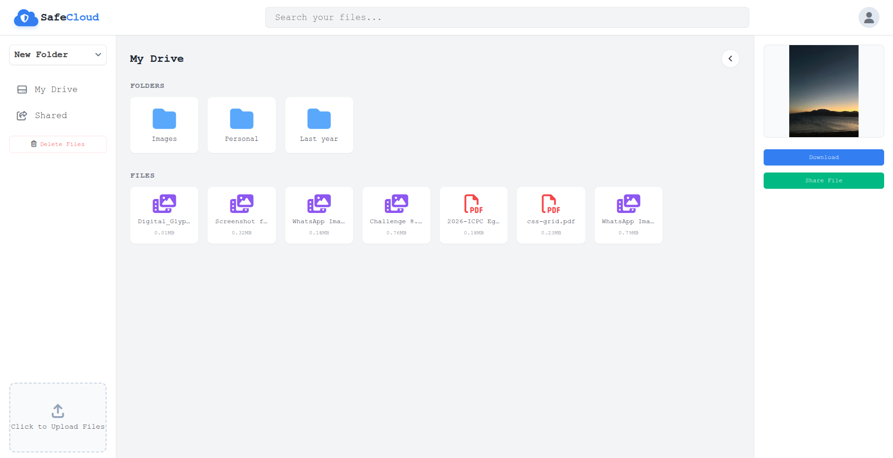
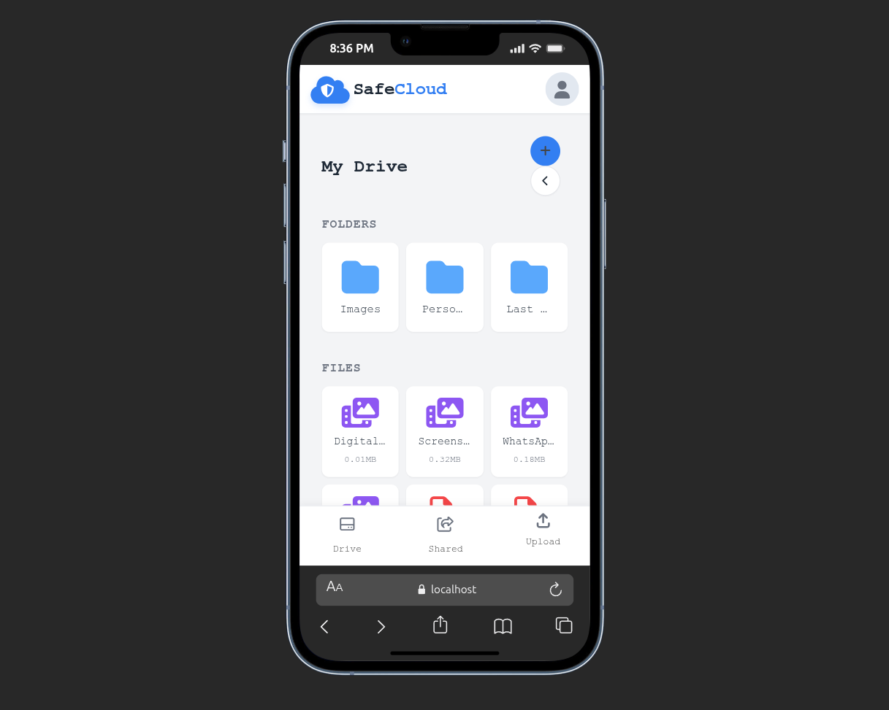
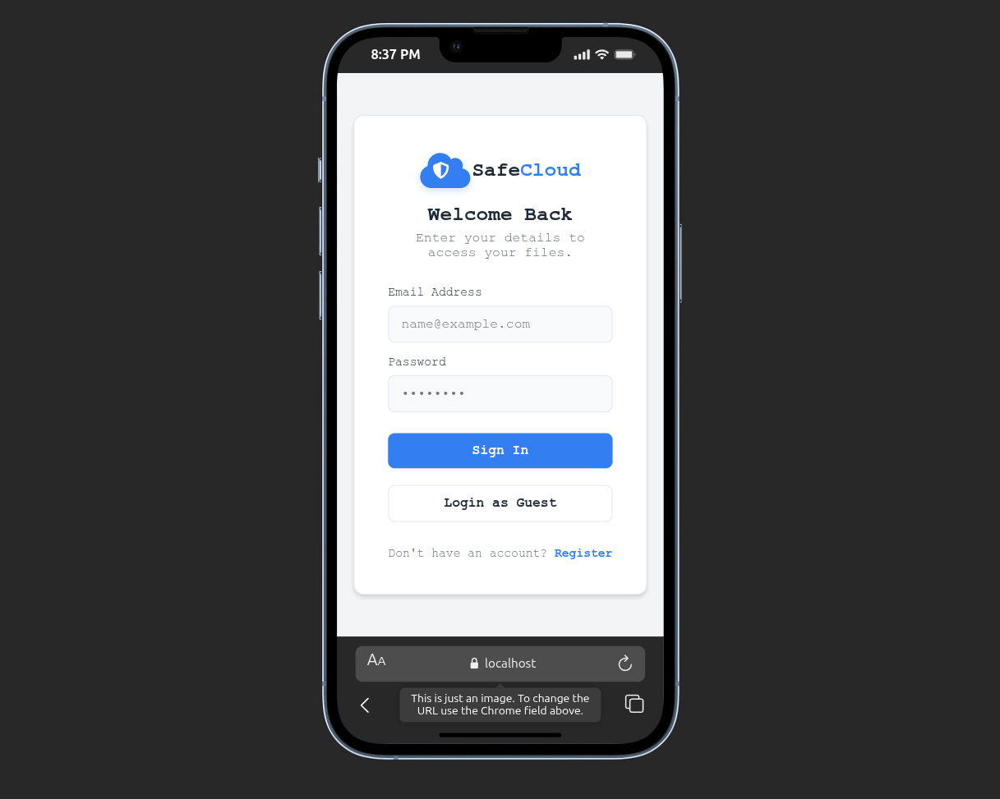
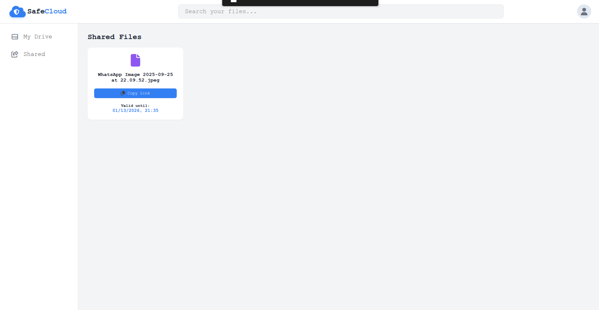

# 📂 Safe (Personal Cloud Storage)

A secure, efficient file storage and sharing application built with Node.js. It features time-limited file sharing, folder management, and real-time upload tracking using standard web technologies.

---

## ✨ Key Features

### 🚀 Smart File Management
- **Upload Progress:** Real-time progress bars using Axios and DOM manipulation/
- **Folder System:** Create, rename, and navigate nested folders to organize your personal cloud.
- **Instant Preview:** View images and PDFs directly in the browser without downloading.

### 🔗 Advanced Sharing
- **Time-Limited Links:** Generate secure share links that automatically expire after a set time (e.g., 1 hour, 1 day).
- **Automated Cleanup:** Logic to invalidate access immediately once the duration expires.

### 🛡️ Security & Architecture
- **EJS Templating:** Fast, server-side rendered pages for a snappy user experience.
- **Prisma ORM:** Type-safe database queries against PostgreSQL.
- **Secure Authentication:** Session-based auth using secure cookies.

---

## 🛠️ Tech Stack

**Core:**
* **Runtime:** Node.js
* **Framework:** Express.js
* **Template Engine:** EJS (Embedded JavaScript)

**Data & Storage:**
* **Database:** PostgreSQL
* **ORM:** Prisma
* **File Handling:** Multer / Streams

**Client-Side:**
 Axios (for async operations like progress bars)

---

