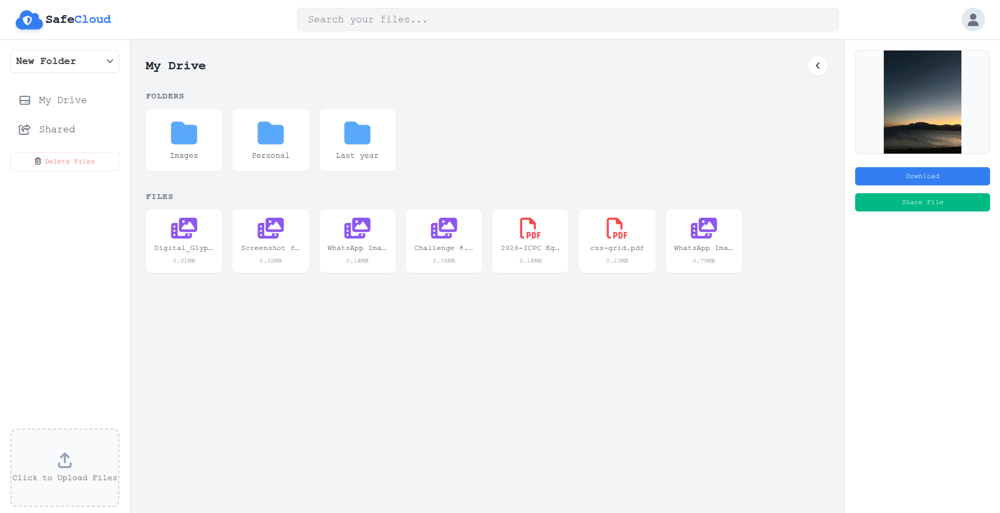
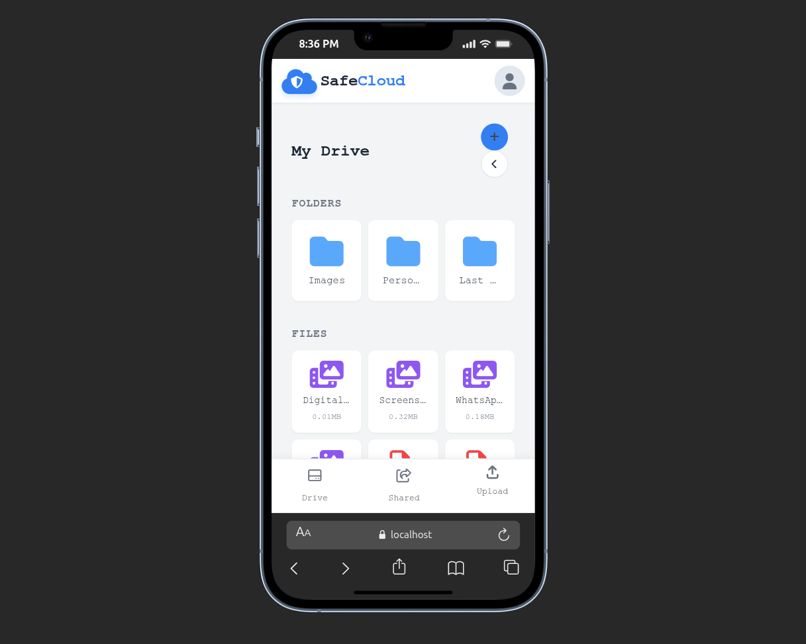
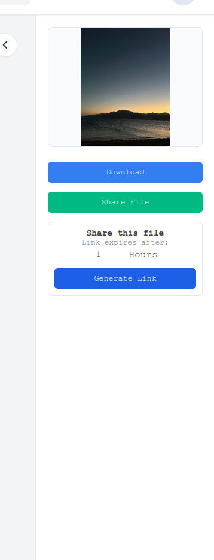
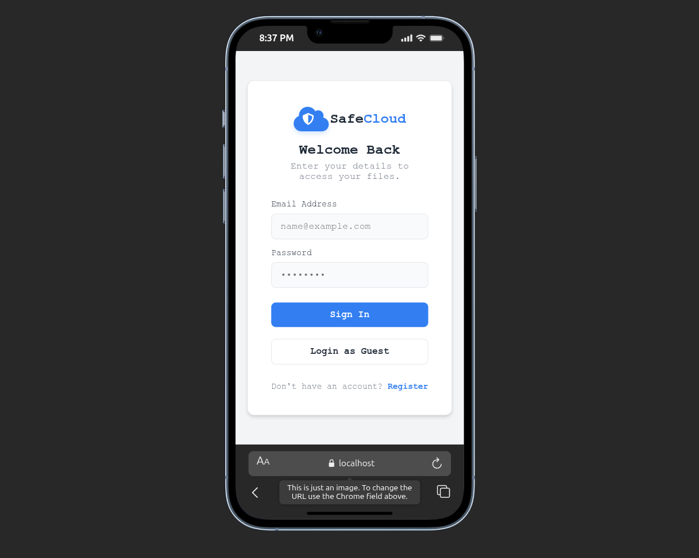
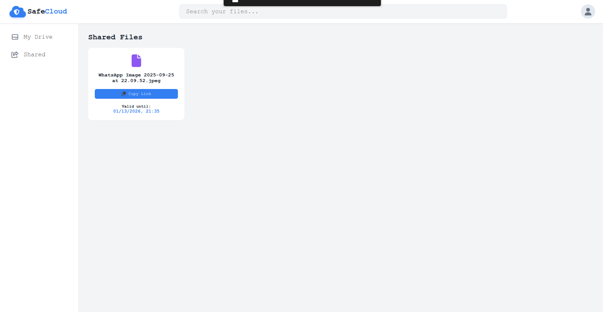

### Personal Cloud Storage app.

I built this project before react, to learn more about templating languages like EJS, 
this project is currently not maintained, I don't know if I will comeback to this project later as react is so powerfull.
the most interesting part in this project was the directory tree that I built with DFS Algorithm.

